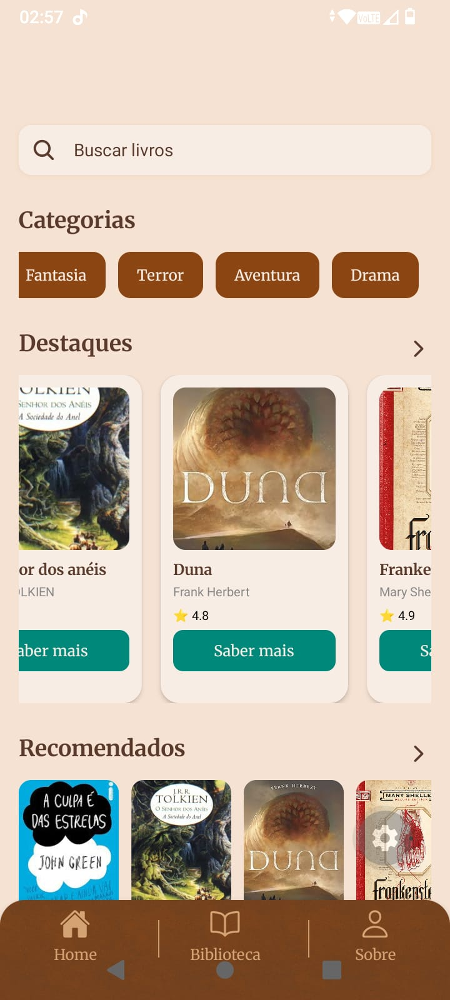

# 📖 Papiro - Biblioteca no seu bolso

Aplicativo de leitura digital desenvolvido para proporcionar uma experiência prática, acessível e moderna para leitura de livros.

---

## 🖼️ Preview

---

## 🎥 Demonstração

---

## Sobre o projeto

O Papiro é um aplicativo de leitura digital que permite ao usuário explorar livros, filtrar por categorias e realizar a leitura diretamente na plataforma.

O projeto evoluiu de uma versão web simples para um aplicativo completo, com foco em experiência do usuário e navegação intuitiva.

---

##  Funcionalidades

-  Busca por nome ou autor  
-  Filtro por categorias  
-  Sistema de favoritos  
-  Página de detalhes do livro  
-  Navegação por abas (Home, Biblioteca, Sobre)  

### Leitor

- Modo escuro  
- Ajuste de tamanho da fonte  
- Leitura de capítulos  
- Leitura por voz (em desenvolvimento)  

---

##  Tecnologias utilizadas

- React Native
- Expo
- TypeScript
- JavaScript
- Styled Components 

