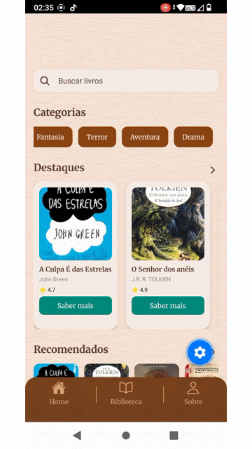

# 📖 Papiro

### *A biblioteca no seu bolso*

  

---

## 🎥 Demonstração

  

---

##  Sobre o projeto

O **Papiro** é um aplicativo de leitura digital desenvolvido com foco em proporcionar uma experiência prática, intuitiva e moderna para leitura de livros.

O projeto começou como uma aplicação web acadêmica e evoluiu para um aplicativo completo, priorizando navegação fluida e experiência do usuário.

---

##  Funcionalidades

| Funcionalidade | Descrição                      |
| -------------- | ------------------------------ |
|  Busca       | Pesquisa por nome ou autor     |
|  Categorias  | Filtro por gêneros literários  |
|  Favoritos    | Sistema de biblioteca pessoal  |
|  Detalhes    | Informações completas do livro |
|  Navegação   | Tabs: Home, Biblioteca e Sobre |

---

## 📖 Experiência de Leitura

  Funcionalidades pensadas para conforto e acessibilidade

*  Modo escuro
*  Ajuste de tamanho da fonte
*  Leitura de capítulos
*  Leitura por voz *(em desenvolvimento)*

---

## Tecnologias utilizadas

React Native • Expo • TypeScript • JavaScript • Styled Components

---

##  Status

🚧 Em desenvolvimento
✔️ Interface completa
🔄 Integração com banco de dados em andamento

---

##  Diferenciais

*  Interface mobile-first
*  Experiência de leitura personalizada
*  Navegação fluida
*  Funcionalidades avançadas em desenvolvimento

---

##  Próximos passos

* Sistema de autenticação
* Integração com banco de dados
* Sincronização de biblioteca
* Finalização da leitura por voz

---

## 💜 Sobre

Projeto desenvolvido com foco em aprendizado prático e evolução contínua em desenvolvimento mobile.
